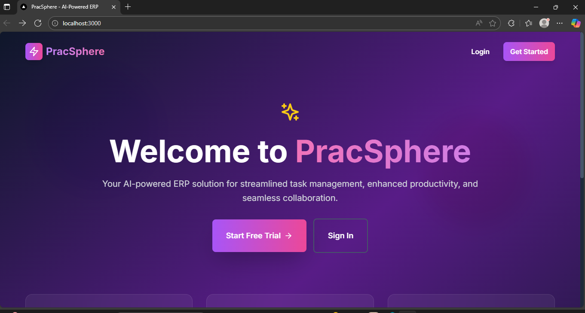
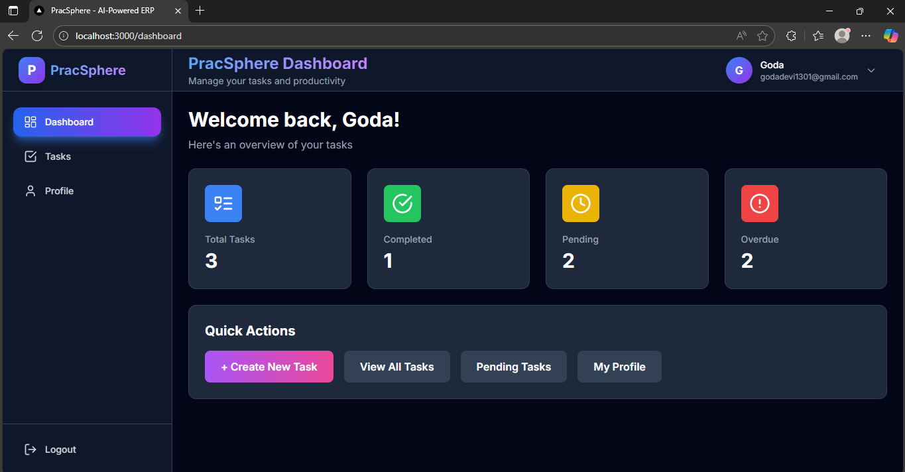
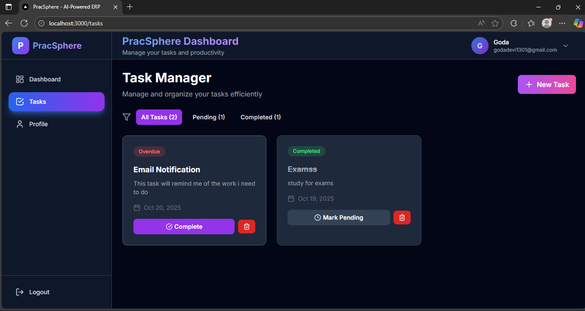
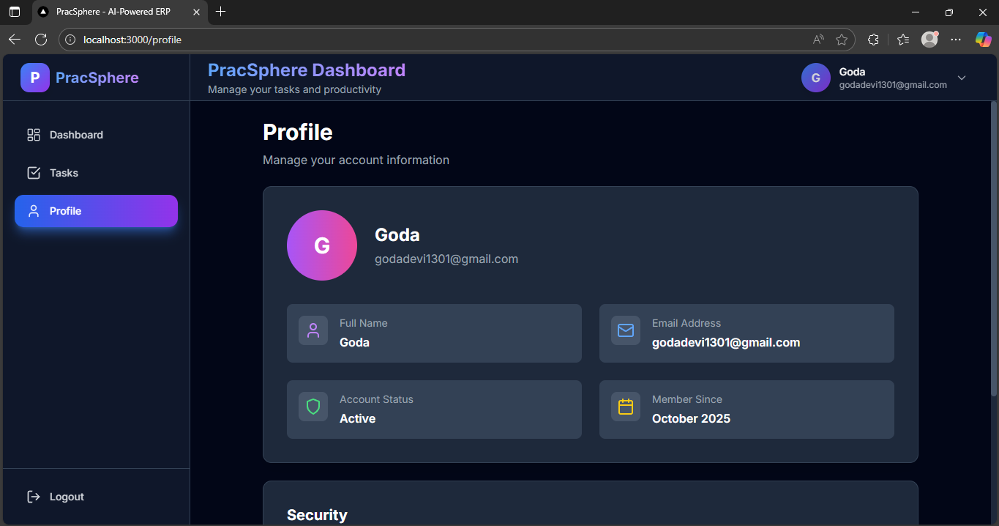

# 🚀 ParcSphere Assignment

<div align="center">


**A modern task management application built with Next.js, TypeScript, and MongoDB**

[](https://opensource.org/licenses/MIT)
[](http://makeapullrequest.com)

</div>

---

## ✨ Features

- 🔐 **Secure Authentication** - User registration and login with NextAuth.js
- 📋 **Task Management** - Create, view, and manage tasks efficiently
- 👤 **User Profiles** - Personalized user dashboard and profile management
- 📱 **Responsive Design** - Beautiful UI that works on all devices
- 🎨 **Modern UI/UX** - Clean interface built with Tailwind CSS
- 🗄️ **Database Integration** - MongoDB for reliable data storage
- ⚡ **Fast Performance** - Optimized with Next.js and Turbo monorepo

## 🛠️ Tech Stack

### Frontend
- **Next.js 14** - React framework with App Router
- **TypeScript** - Type-safe JavaScript
- **Tailwind CSS** - Utility-first CSS framework
- **NextAuth.js** - Authentication for Next.js

### Backend
- **Node.js** - JavaScript runtime
- **MongoDB** - NoSQL database
- **Mongoose** - MongoDB object modeling

### Development Tools
- **Turbo** - Monorepo build system
- **pnpm** - Fast, disk space efficient package manager
- **ESLint** - Code linting
- **Prettier** - Code formatting

## 📁 Project Structure

```
pracsphere-assignment/
│
├── 📦 package.json                    # Root package configuration
├── 📦 pnpm-workspace.yaml             # pnpm workspace configuration
├── ⚡ turbo.json                      # Turbo build configuration
├── 📝 .gitignore                      # Git ignore rules
├── 📖 README.md                       # Project documentation
├── 🔧 setup.sh                        # Setup script
│
├── 📱 apps/
│   └── web/                           # Next.js web application
│       ├── 📦 package.json
│       ├── ⚙️ tsconfig.json
│       ├── 🎨 tailwind.config.ts
│       ├── 🔧 postcss.config.js
│       ├── ⚡ next.config.js
│       ├── 🔐 .env.example
│       ├── 🔐 .env.local
│       │
│       ├── 📁 app/                    # Next.js App Router
│       │   ├── 📄 layout.tsx         # Root layout
│       │   ├── 🏠 page.tsx           # Home page
│       │   ├── 🔄 providers.tsx      # Context providers
│       │   ├── 🎨 globals.css        # Global styles
│       │   │
│       │   ├── 🔐 (auth)/            # Authentication routes
│       │   │   ├── login/
│       │   │   │   └── page.tsx
│       │   │   └── signup/
│       │   │       └── page.tsx
│       │   │
│       │   ├── 📊 (dashboard)/       # Dashboard routes
│       │   │   ├── layout.tsx
│       │   │   ├── dashboard/
│       │   │   │   └── page.tsx
│       │   │   ├── tasks/
│       │   │   │   └── page.tsx
│       │   │   └── profile/
│       │   │       └── page.tsx
│       │   │
│       │   └── 🔌 api/               # API routes
│       │       ├── auth/
│       │       │   ├── [..nextauth]/
│       │       │   │   └── route.ts
│       │       │   └── signup/
│       │       │       └── route.ts
│       │       └── tasks/
│       │           └── route.ts
│       │
│       ├── 📚 lib/                   # Utility libraries
│       │   ├── mongodb.ts           # MongoDB connection
│       │   └── auth.ts              # Authentication config
│       │
│       └── 📝 types/                 # TypeScript type definitions
│           └── next-auth.d.ts
│
└── 📦 packages/
    ├── ui/                           # Shared UI components
    │   ├── 📦 package.json
    │   ├── ⚙️ tsconfig.json
    │   └── src/
    │       ├── index.ts
    │       ├── Button.tsx
    │       ├── Card.tsx
    │       ├── Input.tsx
    │       ├── Sidebar.tsx
    │       └── Topbar.tsx
    │
    └── config/                       # Shared configurations
        ├── tailwind/
        │   └── index.js
        └── typescript/
            ├── base.json
            └── nextjs.json
```

## 🚀 Getting Started

### Prerequisites

Make sure you have the following installed on your system:

- **Node.js 18+** - [Download from nodejs.org](https://nodejs.org/)
- **pnpm** - Package manager
- **MongoDB** - Database

### Installation

1. **Clone the repository**
   ```bash
   git clone https://github.com/Godavangapally/ParcSphereAssignment.git
   cd ParcSphereAssignment
   ```

2. **Install pnpm globally**
   ```bash
   npm install -g pnpm@latest
   ```

3. **Install all dependencies**
   ```bash
   pnpm install
   ```

4. **Set up MongoDB**
   
   **macOS:**
   ```bash
   brew install mongodb-community
   ```
   
   **Ubuntu:**
   ```bash
   sudo apt install mongodb
   ```
   
   **Windows:**
   Download from [mongodb.com](https://www.mongodb.com/try/download/community)

5. **Start MongoDB**
   ```bash
   mongod
   ```
   
   In another terminal:
   ```bash
   mongosh
   ```

6. **Configure Environment Variables**
   
   Create `apps/web/.env.local`:
   ```env
   # Database
   MONGODB_URI=mongodb://localhost:27017/pracsphere
   MONGODB_DB=pracsphere

   # NextAuth
   NEXTAUTH_URL=http://localhost:3000
   NEXTAUTH_SECRET=your-secret-key-here

   # Email (Gmail)
   EMAIL_USER=your-email@gmail.com
   EMAIL_PASS=your-app-password
   NODE_ENV=development
   CRON_SECRET=your-cron-secret
   ```

7. **Start the development server**
   ```bash
   # Start all apps
   pnpm dev
   
   # Or start only the web app
   pnpm dev --filter=web
   ```

8. **Open your browser**
   
   Navigate to [http://localhost:3000](http://localhost:3000)

## 📸 Screenshots

<div align="center">

### 🏠 Landing Page

*Modern landing page with gradient background, feature cards, and call-to-action buttons*

### 📊 Dashboard Overview

*Main dashboard showing task statistics, quick actions, and user information*

### ✅ Task Management

*Task management interface with filtering options and task cards*

### 👤 User Profile

*User profile page with account information and security settings*

</div>

> **Note:** To add screenshots, place your image files in the `docs/screenshots/` directory and update the paths above. The current placeholder images will be replaced once you add the actual screenshots.

## 🛠️ Available Scripts

```bash
# Development
pnpm dev                 # Start all apps in development mode
pnpm dev --filter=web    # Start only the web app

# Building
pnpm build              # Build all apps for production
pnpm build --filter=web # Build only the web app

# Code Quality
pnpm lint               # Run ESLint on all packages
pnpm type-check         # Run TypeScript type checking

# Maintenance
pnpm clean              # Clean all build artifacts and node_modules
```

## 🤝 Contributing

We welcome contributions! Please feel free to submit a Pull Request. For major changes, please open an issue first to discuss what you would like to change.

1. Fork the repository
2. Create your feature branch (`git checkout -b feature/AmazingFeature`)
3. Commit your changes (`git commit -m 'Add some AmazingFeature'`)
4. Push to the branch (`git push origin feature/AmazingFeature`)
5. Open a Pull Request

## 📄 License

This project is licensed under the MIT License - see the [LICENSE](LICENSE) file for details.

## 👨‍💻 Author

**Godavangapally**
- GitHub: [@Godavangapally](https://github.com/Godavangapally)
- Email: godadevi1301@gmail.com

## 🙏 Acknowledgments

- Next.js team for the amazing framework
- MongoDB for the robust database solution
- Tailwind CSS for the beautiful styling system
- All contributors who help improve this project

---

<div align="center">

**⭐ Star this repository if you found it helpful!**

Made with ❤️ by [Godavangapally](https://github.com/Godavangapally)

</div>